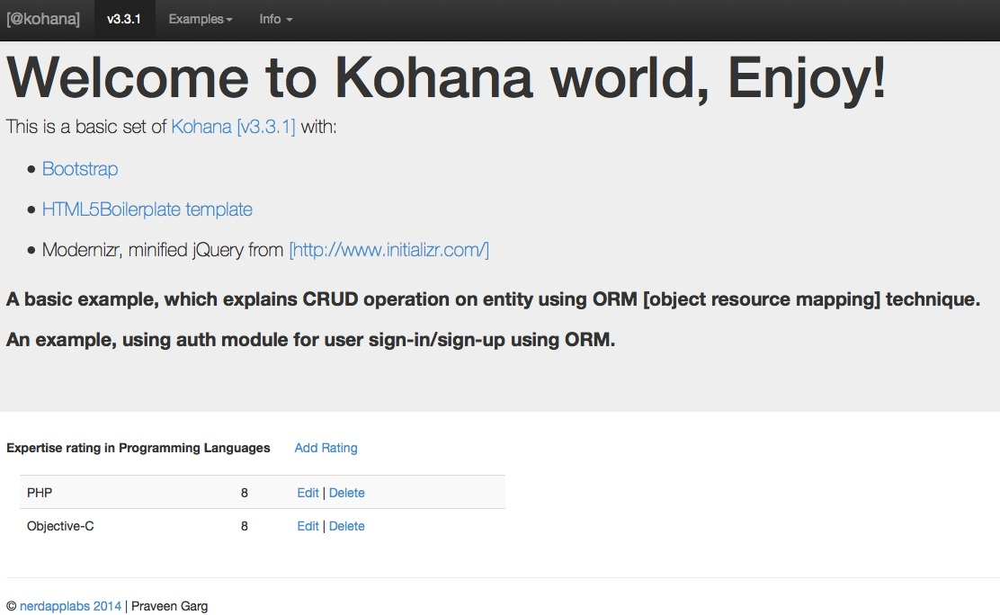
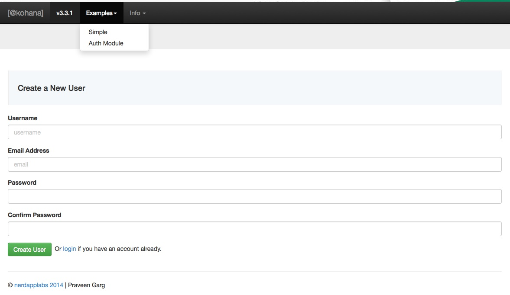

* Kohana [v3.3.1] with H5BP, Bootstrap and a simple tutorial
* Tested/Developed using MAMP & PHP 5.4.4.

__Note:__ NEED TO TEST on ubuntu, fedora [LAMP], windows [WAMP] and XAMPP.

## Examples / Tutorials

### A basic example, which explains CRUD operation on entity using ORM [object resource mapping] technique.

Find [kohana_example.sql] (kohana_example.sql), in app root directory.

### An example, using auth module for user sign-in/sign-up using ORM.

Find [kohana_auth.sql] (kohana_auth.sql), in app root directory.

> Demo login credentials
> praveen/kohana123

__Recommendation:__ use plural name for DB table.

### Directory structure:

        kohana-nerds/
          application/
          assets/
            js/
              main.js
              plugin.js
              vendor/
                bootstrap.js
                jquery-1.10.1.min.js
                ...
            css/
              main.css
              bootstrap.css
              ...
            img/
                ...
            fonts/
                ...
          system/
          .htaccess
          crossdomain.xml
          build.xml
          composer.json
          humans.txt
          robots.txt
          favicon.ico

### Kohana PHP Framework v3.3.1

[Kohana](http://kohanaframework.org/) is an elegant, open source, and object oriented HMVC framework built using PHP5, by a team of volunteers. It aims to be swift, secure, and small.
Released under a [BSD license](http://kohanaframework.org/license), Kohana can be used legally for any open source, commercial, or personal project.

### Initializr
[Initializr] (http://www.initializr.com/)
    H5BP 4.2.0
    Bootstrap 3.0.0
    jQuery 1.10.1

Initializr is an HTML5 templates generator to help you getting started with a new project based on HTML5 Boilerplate. It generates for you a clean customizable template with just what you need to start!

### How to start/install from basic kohana code

[Basic steps to install] (steps-taken-to-install.txt)

__Note:__ [PSR-0 and case-sensitivity] (http://kohanaframework.org/3.3/guide/kohana/tips)

 With the introduction of PSR-0 support, the autoloading of classes is case sensitive.
 e.g. url::base() will work on MAC OSX and windows but not on Linux machine.

 Mainly because filesystems used by Mac OSX and Windows are case insensitive but a Unix/Linux based server is not.

### TODO

P1
* Explaination on examples provided, add Tutorials steps
* pure SQL (with parammeter binding)

P2
* Add unit tests [sorry! I understand it should be the first step. but soon...]

P3
* elaborate HMVC concept with example
* Add <a href="http://fortawesome.github.io/Font-Awesome/license/">Font-Awesome</a>

### Thank you!

[Praveen Garg] (http://www.gargpraveen.blogspot.com/) [@nerdapplabs] (http://nerdapplabs.com)

> All used framework/libraries are trademarks of their respective owners. and open source
> [free licensed to use] to community (as per my knowledge), if any issue please report at:
> (praveen.garg@nerdapplabs.com).

> The use of these does not indicate endorsement of the trademark holder by nerdapplabs,
> nor vice versa.
