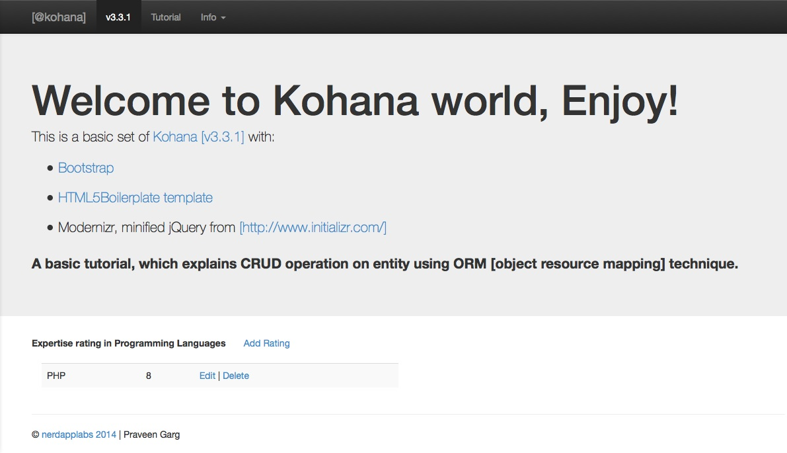

[Kohana [v3.3.1] with H5BP, Bootstrap and a  simple tutorial]

NEED TO TEST on ubuntu, fedora [LAMP], windows [WAMP] and XMPP.

Using php5.4.4 on MAMP

# Tutorial
[Added by Praveen Garg] (http://www.gargpraveen.blogspot.com/)

A basic tutorial, which explains CRUD operation on entity using ORM [object resource mapping] technique.

you can find 'kohana_example.sql', in app root directory. [using db name as 'kohana_example', with table 'ratings' (recommendation: use plural name for tables/realtions)]

# Kohana PHP Framework v3.3.1

[Kohana](http://kohanaframework.org/) is an elegant, open source, and object oriented HMVC framework built using PHP5, by a team of volunteers. It aims to be swift, secure, and small.
Released under a [BSD license](http://kohanaframework.org/license), Kohana can be used legally for any open source, commercial, or personal project.

# Initializr
[Initializr] (http://www.initializr.com/)
    H5BP 4.2.0
    Bootstrap 3.0.0
    jQuery 1.10.1

Initializr is an HTML5 templates generator to help you getting started with a new project based on HTML5 Boilerplate. It generates for you a clean customizable template with just what you need to start!

# Dir structure
  /
   application/
   assets/
        js/
            main.js
            plugin.js
            vendor/
              bootstrap.js
              jquery-1.10.1.min.js
              ...
        css/
          main.css
          bootstrap.css
            ...
        img/
            ...
        fonts/
            ...

  system/
  .htaccess
  crossdomain.xml
  build.xml
  composer.json
  humans.txt
  robots.txt
  favicon.ico

# How to start/install from basic kohana code
[Basic steps to install] (steps-taken-to-install.txt)

# TODO

P1
* Fix Dir structure markdown of README.md for github :)
* Add validations [Server + Client side]
* pure SQL (with parammeter binding)

P2
* Sign- in/up using auth modules
* Add unit tests [sorry! I understand it should be the first step.]

P3
* elaborate HMVC concept with example
* Add <a href="http://fortawesome.github.io/Font-Awesome/license/">Font-Awesome</a>

Thank you!

All used framework/libraries are trademarks of their respective owners. and open source [free licensed to use] to community (as per my knowledge), if any issue please report(praveen.garg@nerdapplabs.com).

The use of these does not indicate endorsement of the trademark holder by nerdapplabs, nor vice versa.
